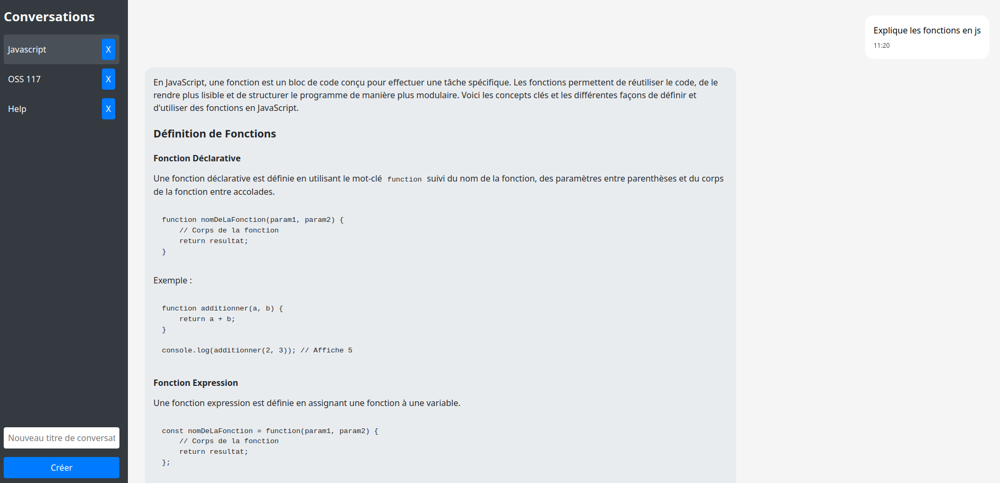

# O'Chat

Ce projet permet de mettre en application les compétences de développeur front-end en réalisant une interface utilisateur permettant d'interagir avec l'API du LLM Mistral.

[Voir le cahier des charges du projet](./cahier-des-charges.md)

ℹ️ Il faudra générer une clé d'API Mistral au cours du projet. Il est possible de suivre le [guide](./token-mistral.md) fourni.

---

## 📚 Fiches Notion : ressources pédagogiques

Le dossier [`notions/`](./notions/) contient des fiches pour vous aider à comprendre certains concepts importants du projet :

- [`localstorage.md`](./notions/localstorage.md) : Comprendre et utiliser localStorage en JavaScript
- [`api-js.md`](./notions/api-js.md) : Appeler une API en JavaScript et utiliser le header Bearer
- [`import-svelte.md`](./notions/import-svelte.md) : Importer des ressources (CSS, JS, images) dans Svelte
- [`etat-null.md`](./notions/etat-null.md) : Comprendre la valeur null et son usage dans les états Svelte

N'hésitez pas à les consulter si vous avez un doute ou une difficulté sur ces sujets !

---

## Énoncés

- [Journée 01 : Wireframe et intégration HTML/CSS dans Svelte](./enonces/j01.md)
- [Journée 02 : Interaction avec l'IA et réponse aux demandes](./enonces/j02.md)
- [Journée 03 : Persistance des données grâce à Pocketbase](./enonces/j03.md)
- [Journée 04 : Système de conversations](./enonces/j04.md)

## Résultat final

